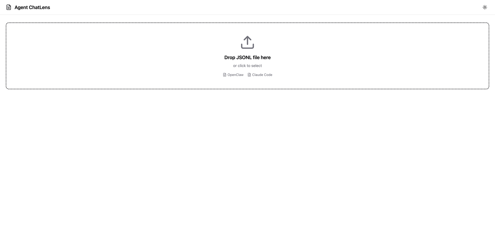
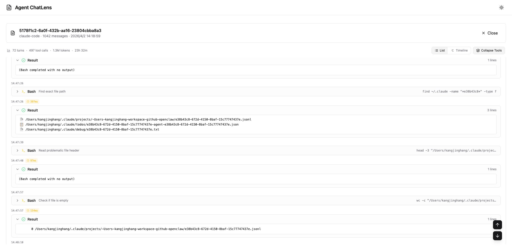
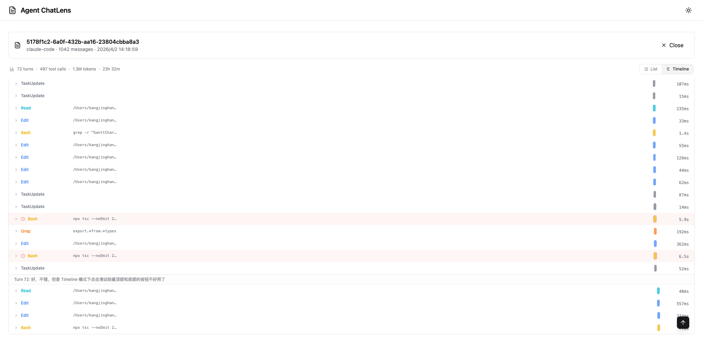

<h1 align="center">Agent ChatLens</h1>

<p align="center">
  <strong>AI 智能体会话文件的优雅 Web 查看器</strong><br>
  轻松查看、分析和调试你的 Claude Code 与 OpenClaw 对话会话。<br>
  拖入 <code>.jsonl</code> 会话文件即可探索——零配置，开箱即用。
</p>

<p align="center">
  <a href="https://kangjinghang.github.io/agent-chatlens/"><strong>在线体验——无需安装</strong></a>
  ·
  <a href="#-快速开始">本地运行</a>
  ·
  <a href="README.md">English</a>
</p>

<p align="center">
  
  
  
  
</p>

<p align="center">
  
  
</p>

<p align="center">
  
</p>

---

## 为什么用 Agent ChatLens？

使用 **Claude Code** 等 AI 编程智能体会产生丰富的对话日志，但在终端里查看这些日志体验很差。Agent ChatLens 提供了一个**优雅的聊天风格界面**，让你可以浏览、搜索和分析会话——零配置。

**只需拖入一个 `.jsonl` 文件，即可开始探索。**

## ✨ 功能特性

### 聊天风格界面
- 💬 **回合式布局** — 消息按用户/助手回合分组，如同聊天应用
- 🧠 **思考过程展示** — 可折叠的推理/思考内容，附带签名信息
- 📋 **代码一键复制** — 代码块上的快捷复制按钮
- ⏱️ **时间戳与耗时** — 工具执行时间标签，回合总耗时显示

### 工具可视化
- 🛠️ **工具专属渲染** — 针对 Bash、Edit、Write、Read、Grep、Glob 等工具的智能展示
- 📊 **内联差异视图** — 可视化 Edit 工具调用中的代码变更
- 📈 **时间线视图** — 甘特图展示工具调用执行时间线与持续时长
- 🔽 **折叠/展开工具** — 一键折叠所有工具调用，支持逐项展开覆盖

### 性能表现
- ⚡ **虚拟滚动** — 流畅处理大型会话（4000+ 消息），告别卡顿
- 📊 **会话统计** — 一览回合数、工具调用数、总 Token 数、会话时长
- 🌙 **深色/浅色主题** 切换

### 零配置
- 📁 **拖放加载** JSONL 文件，即时查看
- 🔍 **自动识别** OpenClaw 和 Claude Code 格式
- 💻 **纯前端** — 无后端、无需安装、无需注册，打开即用

## 🚀 快速开始

### 在线使用（最快）

访问 [kangjinghang.github.io/agent-chatlens](https://kangjinghang.github.io/agent-chatlens/)，拖入一个 `.jsonl` 文件即可。

### 本地开发

```bash
git clone https://github.com/kangjinghang/agent-chatlens.git
cd agent-chatlens
bun install
bun run dev
```

然后打开 http://localhost:3000，拖入 `.jsonl` 文件。

## 📁 支持的格式

### OpenClaw 会话

来自 `~/.openclaw/agents/*/sessions/*.jsonl` 的文件

```jsonl
{"type":"session","version":3,"id":"abc-123",...}
{"type":"message","id":"m1","message":{"role":"user","content":[{"type":"text","text":"Hello"}]}}
{"type":"message","id":"m2","message":{"role":"assistant","content":[{"type":"thinking","thinking":"..."},{"type":"text","text":"Hi!"},{"type":"toolCall","id":"c1","name":"read","arguments":{...}}]}}
{"type":"message","id":"m3","message":{"role":"toolResult","toolCallId":"c1","toolName":"read","content":[...]}}
```

### Claude Code 会话

来自 `~/.claude/projects/*/*.jsonl` 的文件

```jsonl
{"type":"user","uuid":"u1","message":{"role":"user","content":"Hello"}}
{"type":"assistant","uuid":"a1","message":{"role":"assistant","content":[{"type":"text","text":"Hi!"}]}}
{"type":"assistant","uuid":"a2","message":{"role":"assistant","content":[{"type":"tool_use","id":"t1","name":"Bash","input":{"command":"ls"}}]}}
{"type":"user","uuid":"u2","message":{"role":"user","content":[{"type":"tool_result","tool_use_id":"t1","content":"file.txt"}]}}
```

## 🛠️ 技术栈

| 技术 | 用途 |
|---|---|
| **React 18** + TypeScript | UI 框架 |
| **Vite** | 快速构建与开发服务器 |
| **Tailwind CSS** | 样式方案 |
| **@tanstack/react-virtual** | 大型会话虚拟滚动 |
| **react-markdown** + remark-gfm | Markdown 渲染 |
| **react-syntax-highlighter** | 代码高亮 |
| **lucide-react** | 图标库 |

## 📦 构建

```bash
bun run build        # 生产构建
bun run preview      # 预览生产构建
```

## 🧪 测试

```bash
bun test            # 运行测试
bun run test:watch  # 监听模式
```

## 🤝 参与贡献

欢迎贡献！请随时提交 Pull Request。

1. Fork 本仓库
2. 创建特性分支（`git checkout -b feature/amazing-feature`）
3. 提交更改（`git commit -m 'Add amazing feature'`）
4. 推送到分支（`git push origin feature/amazing-feature`）
5. 发起 Pull Request

## 📄 许可证

MIT © [kangjinghang](https://github.com/kangjinghang)

## 🔗 关键词

AI 智能体，会话查看器，JSONL 查看器，OpenClaw，Claude Code，智能体调试，对话分析，工具调用可视化，虚拟滚动，React，TypeScript
